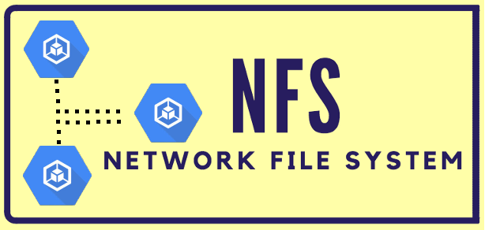
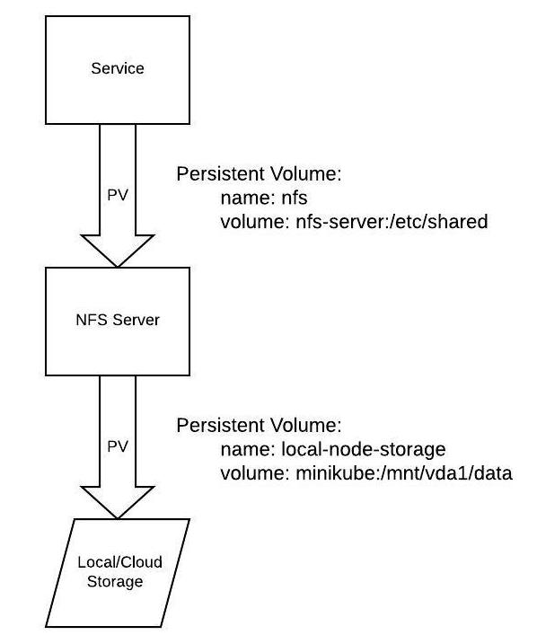

# Network File System Server With Kubernetes



[What is an NFS Server?](https://en.wikipedia.org/wiki/Network_File_System)

## NFS in K8
There is an order of operations with running an NFS server in Kubernetes.

Below is an architecture overview of the setup, which is based off of the example in the [kubernetes git repo](https://github.com/kubernetes/examples/tree/master/staging/volumes/nfs).



**NOTE:** The persistent volume for local-node-storage runs out of space pretty quickly when mounted within minikube, so I have adjusted the mount point for local development to be outside of the minikube vm on the host computer. Continue reading and/or view `nfs/set_local_pv` for more details.

## Makefile

All the commands used to run the NFS server, as well as some other helper commands, can be found in the `Makefile`.

Run these commands using the `make` command, proceeded by the command you want to run in the `Makefile`. 

Continue reading for how to run the NFS server.

### TL;DR
These commands automate the manual steps in the `Step-by-step` section.

Setup:
```bash
make deploy_nfs-all
```
Tear down:
```bash
make delete_nfs-all
```

To not run into errors, you will want to make sure the `make` command is on your system, as well as install [minikube](https://minikube.sigs.k8s.io/docs/start/) and [docker](https://docs.docker.com/get-docker/)

#### Test

A small test file is also included, located in `nfs/nfs_test`. This is used to verify that the service can install and run.

Run it with the following command: `make test_nfs`

### Step-by-step
- The first step is to generate the local persistent volume and persistent volume claim that will be consumed by the NFS server.
```bash
make deploy_local-pv
```
This first persistent volume (PV) is a local hostPath volume that mounts within minikube. This is for development use only and should be replaced by a cloud-backed storage persistent volume claim when run in production. This local PV is mounted to the NFS server pod as the main volume storage for the NFS server.

- The next step is to deploy the NFS server:
```bash
make deploy_nfs-server
```
This generates an NFS-server based on the Dockerfile and init script in this directory, as well as a corresponding service for the pod.

- Now it is time to create the second PV, which is specifically an NFS persistent volume that takes in a running NFS server IP and file mount location to expose to other services.

```bash
make deploy_nfs-pv
```
A look at what is happening in this command:

Because we are running our own NFS server within Kubernetes, we only know the IP of the server after it is running, so at this step we need to get the server IP, you can do this manually by running:
```bash
kubectl get svc
```  
The server IP for the nfs-server will be listed under the ClusterIP column. This is then copied into the `deployment/nfs-pv.yml` file in the nfs server field, replacing `{{nfs-server.default.svc.cluserIP}}`.

The make command (`make deploy_nfs-pv`) for applying the `deployment/nfs-pv.yml` file programmatically grabs the Cluster IP of the running nfs-server and creates a tmp file to apply. Similarly the `make delete_nfs-pv` command removes this tmp file and deletes the k8 resources in that file.

A note about Persistent Volume Claims (PVC) that are grouped with the persistent volumes; they are the method by which pods make requests to access volumes.

- The final step to apply the NFS server system to work with a pod is to add the PVC to the pod setup as a volume mount:
```yaml
spec:
  containers:
    - name: <pod-name>
      volumeMounts:
        - name: nfs
          mountPath: "/etc/shared"      #choose whatever mount path for the pod
  volumes:
    - name: nfs
      persistentVolumeClaim:
        claimName: nfs
``` 
#### Verify
It is important to verify that the system is working as expected, but how do you do that?

- Check that the local persistent volume is mounted to the NFS server by logging into the NFS server and create a file.
```bash
# log into the nfs-server pod (get the full name from `kubectl get pod` command)
kubectl exec -it <nfs-server-full-pod-name> -- sh
cd /etc/shared
touch unicorns.txt
``` 
`unicorns.txt` was just created in the nfs-server mount point, now verify that it is also visible from the local mount point on your computer.

The local mount point was generated from the `nfs/set_local_pv` script. The location is one of the following, depending on OS:

`mount_point=`
```bash
/Users/${user_id}/mounted-pv-data (mac) 
/home/${user_id}/mounted-pv-data (linux)
```

Check this location:

```bash
ls $mount_point

# you should see the following output if all was set up correctly: 

unicorns.txt
```

Subsequent pods that are generated can now add this volume mount and have access to this shared location across pods. 

```bash
volumeMounts:
  - name: local
    mountPath: "/etc/shared"
```

Swap out the `local-pv.yml` for a cloud backend when moving off of local development.

## Troubleshooting

### K8
Checking running kubernetes services:
```bash
kubectl get pod
kubectl get svc
kubectl get pv
kubectl get pvc
```
Get more details on a specific service:
```bash
kubectl describe pod <pod-name>
kubectl describe svc <svc-name>
...etc
```
Logging into a pod to run commands and check things out:
```bash
kubectl exec -it <pod-name> sh
```

If a PV or PVC hangs during deletion, you can manually edit and remove the finalizers to release them:
```bash
kubectl patch pvc pvc_name -p '{"metadata":{"finalizers":null}}'
kubectl patch pv pv_name -p '{"metadata":{"finalizers":null}}'
```
See [this issue thread](https://github.com/kubernetes/kubernetes/issues/77258#issuecomment-502209800) for more details.

### NFS client/server
Check connectivity to the server and available exports:
```bash
# log into server or client pod 
showmount -e <nfs-server-ip>
```
Test manual mounting if there are volume mounting issues:
```bash
# log into server pod - test that mounting is working at the server network level
mount -v 127.0.0.1:/mnt /client/mnt
# show available mounts 
mount
```
```bash
# log into client pod - test that mounting can happen from the client pod to the NFS server pod
mount -v <nfs-server-cluster-ip>:/ /etc/shared
# show available mounts
mount
```
Check that all rpc services are running as expected:
```bash
# log into NFS server
rpcinfo -p
# should give output similar to the following:
  program vers proto   port  service
   100000    4   tcp    111  portmapper
   100000    3   tcp    111  portmapper
   100000    2   tcp    111  portmapper
   100000    4   udp    111  portmapper
   100000    3   udp    111  portmapper
   100000    2   udp    111  portmapper
   100003    4   tcp   2049  nfs
   100005    1   udp  48988  mountd
   100005    1   tcp  46749  mountd
   100005    2   udp  45417  mountd
   100005    2   tcp  40393  mountd
   100005    3   udp  58823  mountd
   100005    3   tcp  50841  mountd

```
The `vers` column relates to the NFS version. We are running NFSv4.
You can also check what version is being used by running the `mount` command. 

Also, a helpful article on [NFS Troubleshooting](http://nfs.sourceforge.net/nfs-howto/ar01s07.html).
And on [NFSv4](https://help.ubuntu.com/community/NFSv4Howto).
